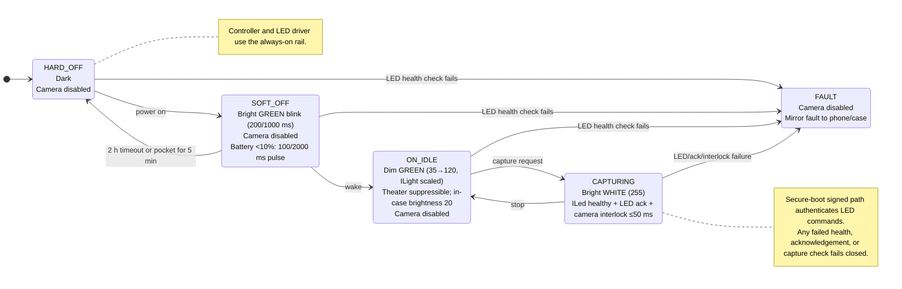

<p align="center">
  <a href="https://github.com/dfeen87/trust-beacon/actions/workflows/ci.yml"></a>
  <a href="LICENSE"></a>
  
  <a href="https://github.com/donfeeney/trust-beacon/releases/tag/v1.1.0"></a>
  
</p>

# Trust Beacon



Production firmware inverting trust LED: bright blink GREEN=OFF safe, dim GREEN=ON idle, bright WHITE=capturing. Always-on MCU rail, 200/1000ms duty cycle for 90h soft-off, IMU/proximity auto hard-off, adaptive brightness, hardware interlock, secure-boot, shippable via software update, no HW change.

## Features

- Allocation-free C++17 controller with `noexcept` hardware interfaces.
- Fail-closed camera control with LED health, acknowledgement, and independent
  capture-interlock checks.
- Always-visible bright off/capture disclosures that cannot be attenuated by
  ambient-light, case, theater, or battery policies.
- Power-aware soft-off pulse, automatic hard-off, adaptive idle brightness,
  and theater-mode idle suppression.
- Hardware abstractions for LED, camera, battery, power, ambient light, and IMU.

## User-Visible Contract

| State | Indicator | Camera |
|---|---|---|
| Hard off | Dark | Disabled |
| Soft off | Bright blinking green | Disabled |
| On, idle | Dim solid green (theater mode may hide it) | Disabled |
| Capturing | Bright solid white | Hardware-interlocked |

Low battery changes soft-off to a short green pulse every two seconds. Ambient
light scaling and in-case dimming affect only the idle indication; they can
never weaken the off or capture disclosure. A failed LED health check, command
acknowledgement, or capture interlock disables the camera.

## Integration Requirements

This library is allocation-free and exception-free at its hardware boundary.
The platform implementation remains responsible for guarantees that software
alone cannot provide:

- Run the controller and LED driver from the always-on rail.
- Enforce secure boot and authenticate commands in `ILed::set`.
- Electrically gate the ISP using `ICamera::can_capture`, with an LED
  acknowledgement deadline of at most 50 ms.
- Monitor LED open/short/over-temperature conditions in `ILed::healthy`.
- Validate calibrated brightness across temperature, aging, and production
  bins, and use inaudible/spread-spectrum PWM where required.
- Mirror a trust-indicator fault to the paired device or charging case.

Treat a `false` result from `update` as a safety fault. The controller already
disables capture; callers should additionally record diagnostics and notify the
user without retrying capture.

## Build and Test

```sh
cmake -S . -B build -DCMAKE_BUILD_TYPE=Release
cmake --build build
ctest --test-dir build --output-on-failure
```

Enable AddressSanitizer and UndefinedBehaviorSanitizer with
`-DSANITIZE=address,undefined`. Consumers can install the library and public
header with `cmake --install build --prefix <prefix>`.

## Project Structure

| Path | Purpose |
|---|---|
| `include/trust_beacon/` | Installed public API |
| `src/` | Controller implementation |
| `tests/` | Catch2 unit tests for safety and indication behavior |
| `.github/workflows/` | Build, lint, and sanitizer automation |

## License

Trust Beacon is available under the [MIT License](LICENSE).

## Acknowledgements

This project was built in a day with a little help from AI pair-programmers.

**Meta AI** — was my soundboard and systems thought partner. We co-designed the fail-closed contract (bright blink GREEN = OFF safe, dim GREEN = ON idle, bright WHITE = capturing), the always-on MCU duty cycle, IMU auto hard-off, hardware interlock with 50ms ack, and the secure-boot requirements. It helped turn a LinkedIn idea about bystander trust into a shippable C++17 spec.

**Codex** — assisted with coding, CMake scaffolding, header layout in `include/trust_beacon/`, `ProductionTrustController` implementation, and the unit-test suite validating fail-closed semantics.

The architecture, integration requirements, and final decisions are mine. The AI tools accelerated the build — the responsibility for trustworthy signaling stays human.
